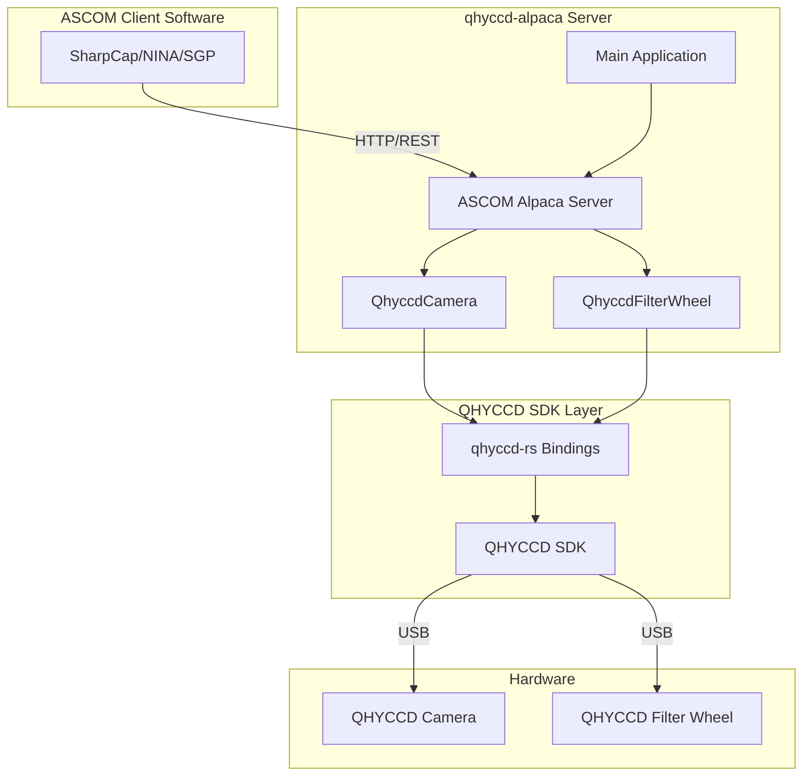
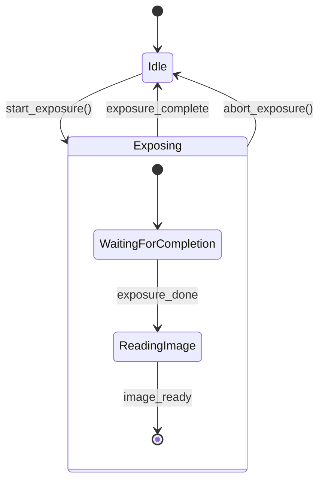
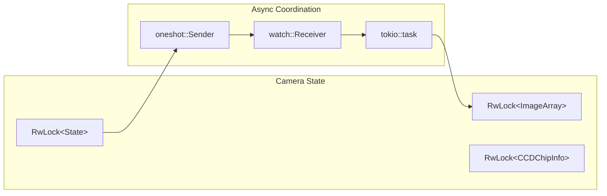
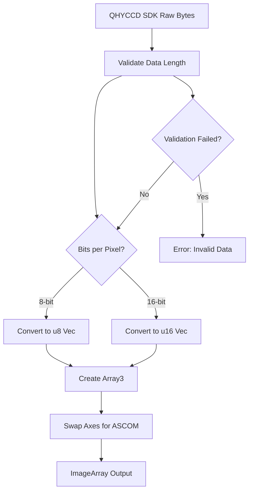
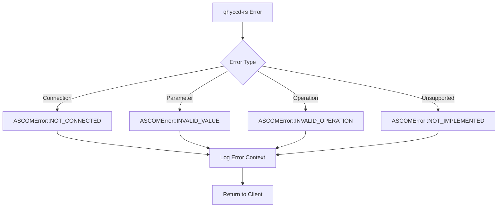
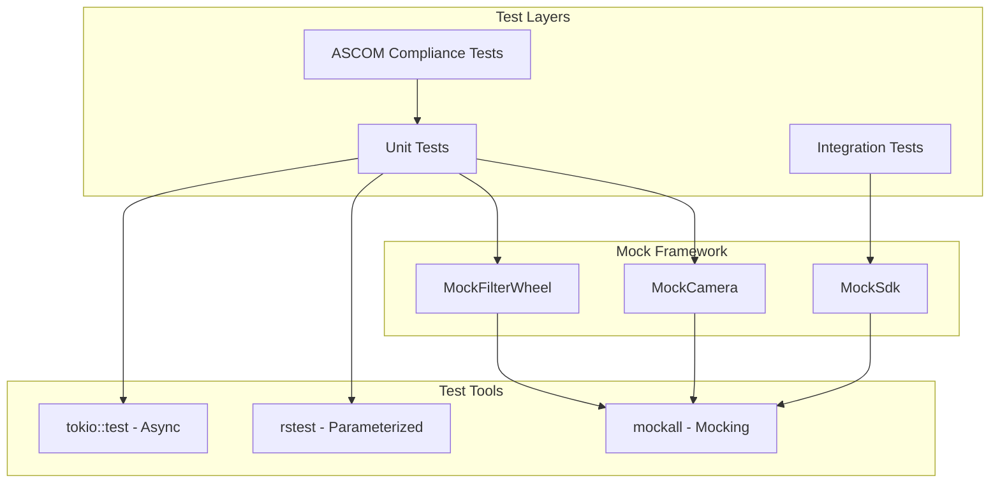

# QHYCCD Alpaca Driver Design Document

## Overview

The qhyccd-alpaca project is an ASCOM Alpaca driver for QHYCCD cameras and filter wheels, written in Rust. It provides a bridge between QHYCCD hardware and ASCOM-compatible astronomy software through the Alpaca REST API protocol.

**Note: This crate provides only driver binaries, not library APIs. It is designed as a standalone application that implements the ASCOM Alpaca protocol.**

## Architecture

### Core Components

#### 1. Main Application (`main.rs`)
- **Entry Point**: Tokio-based async main function
- **CLI Interface**: Uses clap for command-line argument parsing (port, log level)
- **Server Setup**: Initializes ASCOM Alpaca server with device registration
- **Device Discovery**: Enumerates connected QHYCCD cameras and filter wheels

#### 2. Camera Implementation (`QhyccdCamera`)
- **Device Wrapper**: Wraps `qhyccd_rs::Camera` with ASCOM Alpaca Camera trait
- **State Management**: Tracks exposure state (Idle/Exposing) with async coordination
- **Image Processing**: Transforms QHYCCD image data to ASCOM ImageArray format
- **ROI Management**: Handles region-of-interest and binning operations

#### 3. Filter Wheel Implementation (`QhyccdFilterWheel`)
- **Device Wrapper**: Wraps `qhyccd_rs::FilterWheel` with ASCOM Alpaca FilterWheel trait
- **Position Tracking**: Manages target vs actual filter positions
- **Filter Management**: Provides generic filter naming and focus offset handling

### Dependencies

#### External Crates
- **ascom-alpaca**: ASCOM Alpaca protocol implementation (server, camera, filter_wheel features)
- **qhyccd-rs**: Rust bindings for QHYCCD SDK
- **tokio**: Async runtime with multi-threaded support
- **tracing**: Structured logging framework
- **ndarray**: N-dimensional array processing for image data
- **parking_lot**: High-performance RwLock implementation
- **eyre**: Error handling and reporting

#### Development Dependencies
- **mockall**: Mock object generation for testing
- **rstest**: Parameterized testing framework

## Device Management

### Camera Features
- **Exposure Control**: Single-frame exposures with async state tracking
- **Binning Support**: 1x1 to 8x8 binning modes (hardware dependent)
- **ROI Configuration**: Configurable region of interest
- **Temperature Control**: Cooling support where available
- **Gain/Offset Control**: Hardware-dependent parameter adjustment
- **Bayer Pattern Support**: Color camera debayering information

### Filter Wheel Features
- **Position Control**: Absolute position setting and monitoring
- **Filter Management**: Generic filter naming scheme
- **Status Monitoring**: Position verification and movement tracking

## State Management

### Camera State Machine

### Concurrency Model

### Concurrency Model
- **RwLock Protection**: All mutable state protected by parking_lot RwLocks
- **Async Coordination**: Uses tokio channels for exposure control
- **Thread Safety**: Full async/await support with Send + Sync traits

## Image Processing Pipeline

### Data Transformation
1. **Raw Data**: QHYCCD SDK provides raw image bytes
2. **Validation**: Verify data length matches expected dimensions
3. **Conversion**: Transform to appropriate bit depth (8/16-bit)
4. **Array Creation**: Build ndarray::Array3 with proper dimensions
5. **Axis Swapping**: Adjust for ASCOM coordinate system
6. **ASCOM Format**: Convert to ImageArray for client consumption

### Supported Formats
- **Bit Depths**: 8-bit and 16-bit images
- **Color Modes**: Monochrome and color (Bayer pattern)
- **Channels**: Single-channel images only

## Error Handling

### Error Strategy
- **eyre Integration**: Comprehensive error context and reporting
- **ASCOM Mapping**: Converts qhyccd-rs errors to appropriate ASCOM error codes
- **Logging**: Structured error logging with tracing framework
- **Graceful Degradation**: Handles missing hardware features gracefully

### Common Error Scenarios
- **Device Not Connected**: Returns NOT_CONNECTED for disconnected devices
- **Invalid Parameters**: Returns INVALID_VALUE for out-of-range values
- **Hardware Failures**: Returns appropriate ASCOM error codes
- **Unsupported Operations**: Returns NOT_IMPLEMENTED for missing features

## Testing Strategy

### Test Structure
- **Unit Tests**: Comprehensive camera and filter wheel functionality testing
- **Mock Framework**: Uses mockall for hardware abstraction during testing
- **Parameterized Tests**: rstest for testing multiple scenarios
- **Integration Tests**: End-to-end ASCOM compliance testing

### Test Coverage
- **Connection Management**: Connect/disconnect scenarios
- **Parameter Validation**: Boundary condition testing
- **State Transitions**: Exposure state machine validation
- **Error Conditions**: Comprehensive error handling verification

## Configuration and Deployment

### Runtime Configuration
- **Port Selection**: Configurable HTTP port (default: 8000)
- **Logging Levels**: trace, debug, info, warn, error
- **Environment Variables**: RUST_LOG support for log level override

### System Requirements
- **QHYCCD SDK**: Version 24.12.26 required
- **libusb**: libusb-1.0.0 for USB communication
- **Rust**: Minimum version 1.86.0
- **Operating Systems**: Linux (tested on Ubuntu/Kubuntu, Raspberry Pi OS)

## Limitations and Known Issues

### Current Limitations
- **LiveMode**: Not implemented (single-frame only)
- **16-bit Requirement**: Only supports cameras with 16-bit transfer capability
- **FastReadout**: Implemented but untested due to hardware limitations
- **Pulse Guiding**: Not implemented
- **Color Processing**: Limited to Bayer pattern information only

### Hardware Compatibility
- **Tested Cameras**: QHY5III290C, QHY178M, QHY600M (QHY5III178M has known issues)
- **Tested Filter Wheels**: QHYCFW3L-SR
- **Software Compatibility**: SharpCap, ACP, NINA, SGP

## Future Enhancements

### Planned Features
- LiveMode implementation for real-time imaging
- Enhanced color camera support
- Pulse guiding implementation
- Additional hardware model support
- Performance optimizations

### Architecture Improvements
- Plugin system for custom image processing
- Configuration file support
- Enhanced error recovery mechanisms
- Metrics and monitoring capabilities
